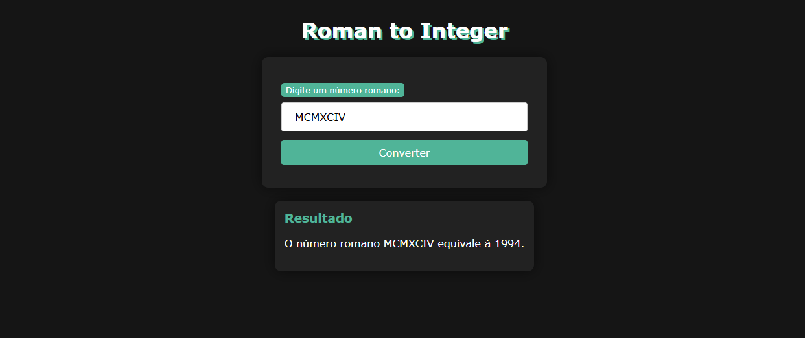

<div align="center">
  <h1>- Desafio: 3 Algoritmos em PHP
 -</h1>
</div>

Este repositório contém soluções para três desafios clássicos de algoritmos, implementados em PHP. Os desafios foram propostos pelo mentor Marco Castro da [DesenvolvendoMe](https://desenvolvendo.me/) e são os seguintes:

⬪ Desafio 1 - Roman to integer: Converter Números Romanos para Inteiros;<br>
⬪ Desafio 2 - Remove element: Remover Elementos de um Array;<br>
⬪ Desafio 3 - Two sum: Soma de Dois Números.

Os desafios foram descritos e resolvidos na plataforma LeetCode. Clique nos botões abaixo para acessar os links diretamente.

[](https://leetcode.com/problems/roman-to-integer/description/)
[](https://leetcode.com/problems/remove-element/description/)
[](https://leetcode.com/problems/two-sum/description/)

<h2> 🧮 Ferramentas e tecnologias </h2>


<h2> 📚 Estrutura </h2>
Dentro das pastas, encontra-se dois arquivos em PHP:

⬪ O arquivo leetcode.php contém a resolução do desafio e aceita o input como argumento para a função. Este arquivo pode ser copiado e colado diretamente no site da LeetCode para teste, mas também incluímos exemplos de testes no terminal. Um exemplo de como utilizá-lo é:

```PHP
    $solution = new Solution();
    $result = $solution->romanToInt("MCMXCIV");
    echo $result;
```

⬪ O arquivo index.php é uma aplicação web que permite a interação direta com o usuário para resolver os desafios. Diferente da versão para terminal, este código permite que os usuários insiram os valores diretamente através de um formulário na página web. Abaxo é possível vê um exemplo dá aplicação estruturada.

<p align="center">
    
</p>

<p>Este repositório foi criado para fins de estudo</p>

------------
Disponibilizado por [Verônica Vilas](https://www.linkedin.com/in/veronica-vilas/ "veronica-vilas").

